## Introduction

All examples below constitute a tutorial to get started with using the main
functions of this library, starting from `square.geo` used to generate a mesh
with gmsh.

## field_on_square

[`field_on_square`](./field_on_square/main.cpp) is a minimal client loading
a square mesh, looping on whole its vertices to assign the value y-(2x-1)²
from the coordinates (x,y) and output it in a vtu file.
  

    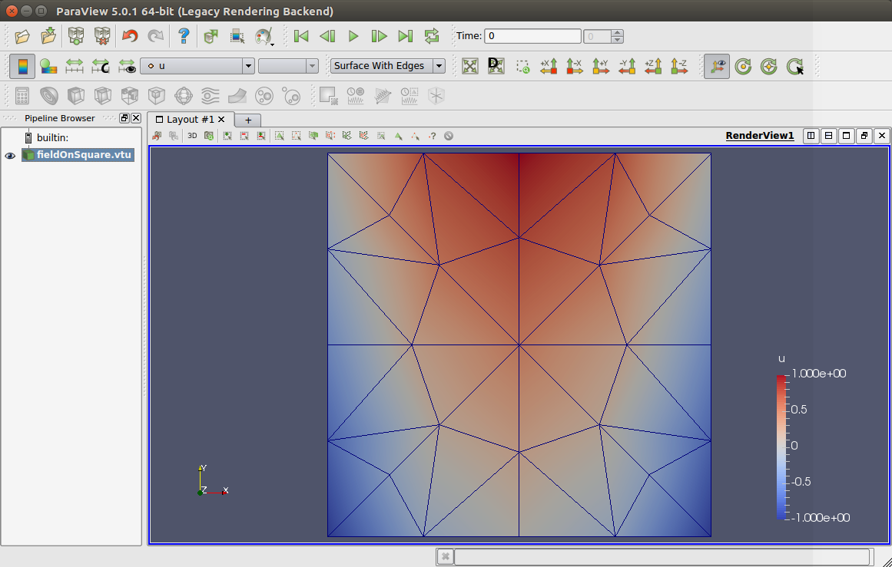
  

## castle

[`castle`](./castle/main.cpp) is intended to be run with
`mpirun -n 2 ./osh_castle`. The local and
global indices of the vertices of each triangle in a very coarse mesh are
written on `std::cout`. Then some iterations over the triangles and the
vertices are performed to investigate the usage of ghost elements depending
on the definition of a macro `NOGHOSTS`.

####  With `#define NOGHOSTS`

each proc assigns its <b>rank</b> on the vertices; note that this field is
discontinuous because of a vertex shared by two differents procs gets two
different values depending on the rank  
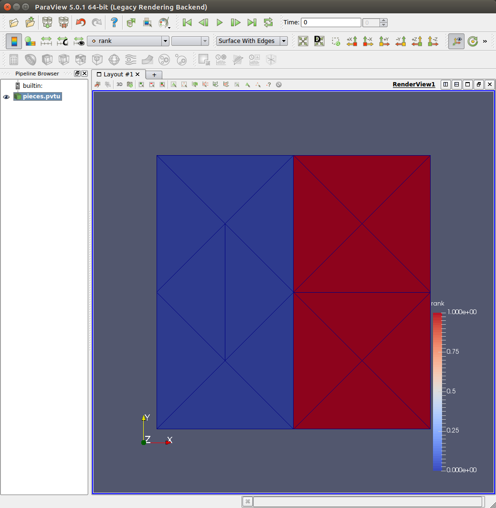  
the field <b>synced_rank</b> is now continuous with value 0 because the
shared vertices are all owned by rank 0 
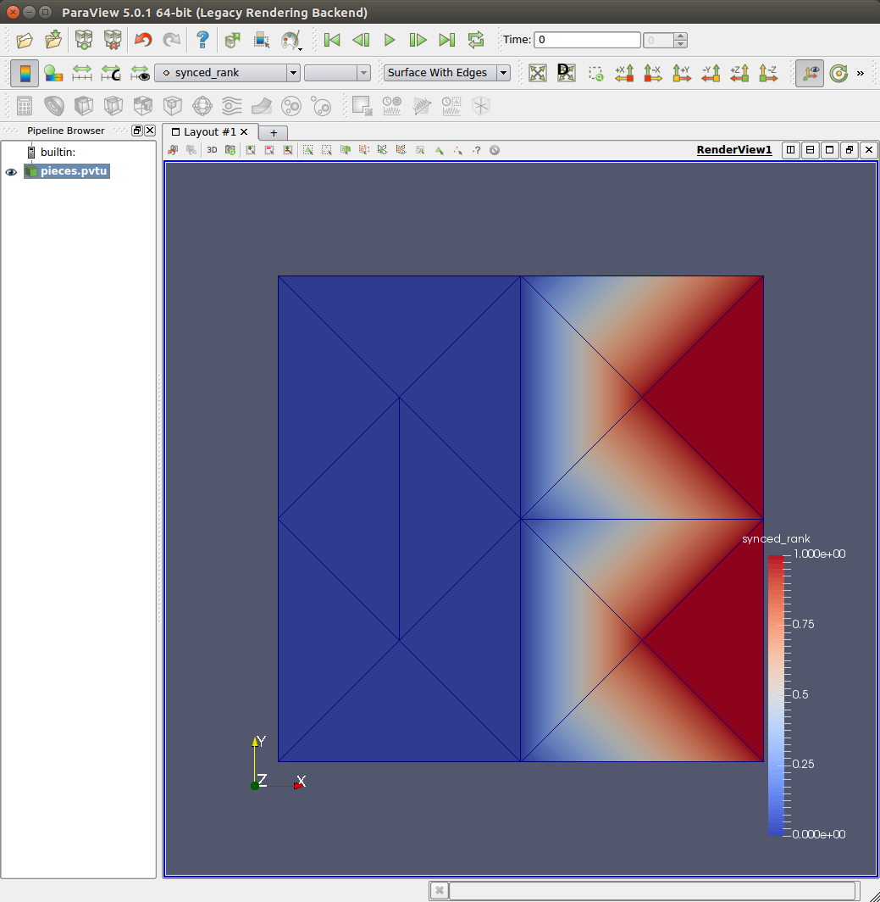  
the field <b>weighted_sum</b> is defined such as each vertices is namely
increased by 20% of the sum of the value at its neighboring vertices; note
that this field is again discontinuous and exactly 0 on rank 0  
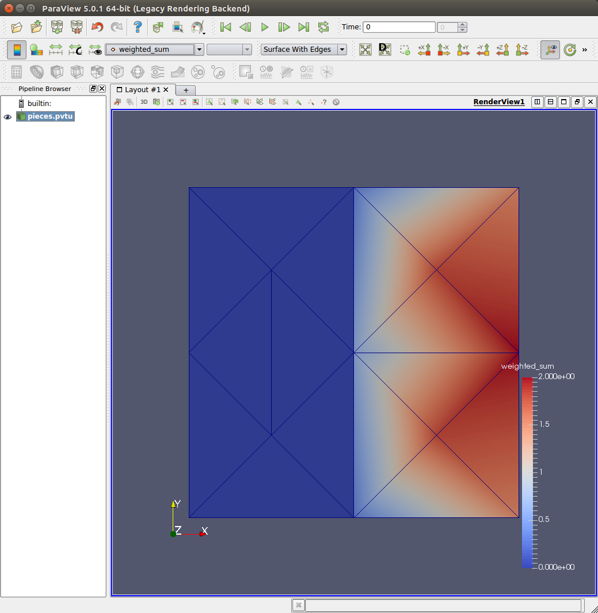  
the field <b>synced_weight_sum</b> is now continuous but its value is again
0 on rank 0; it was not affected by the weighted sum  
  

#### With ghost elements, i.e., without `#define NOGHOSTS`

each proc is assigning its <b>rank</b> on the vertices; note that we cannot
visualize any longer both piece of the partition because the ghost elements
would be superposed and have different values  
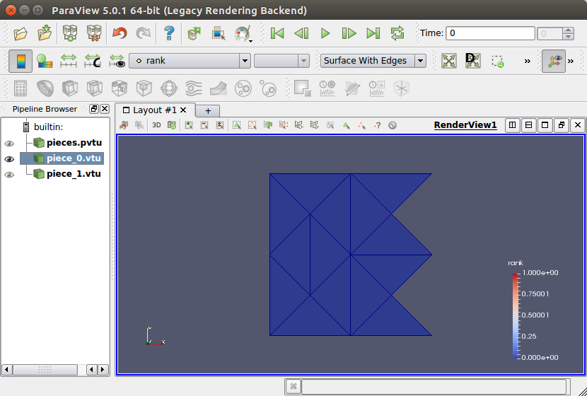 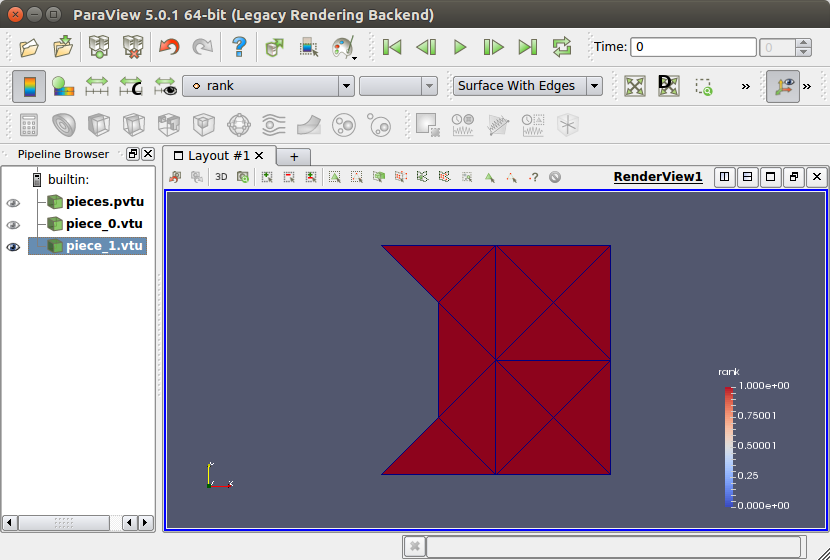  
the field <b>synced_rank</b> with ghost elements is the same without ghost
elements because all ghost vertices received the rank of the owner  
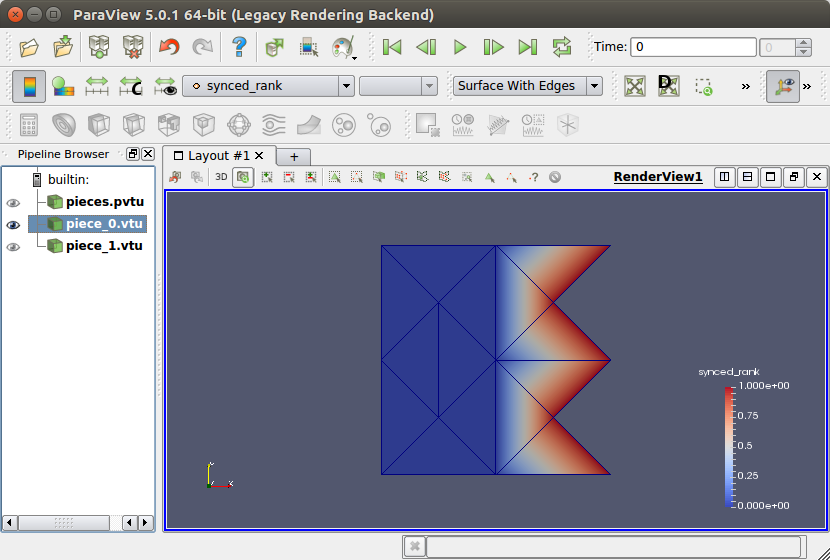 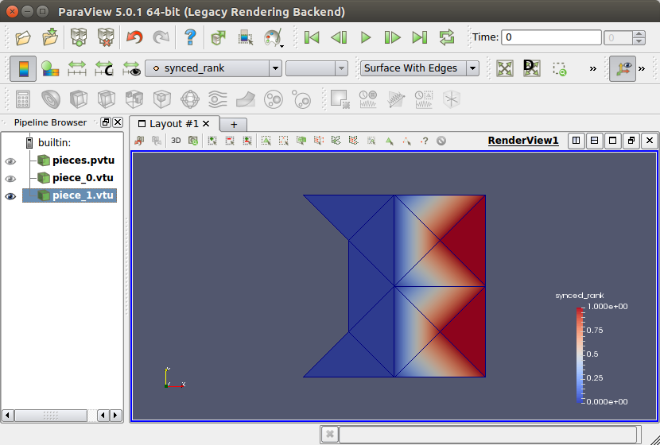 
the field <b>weighted_sum</b> is defined such as each vertices is namely
increased by 20% of the sum of the value at its neighboring vertices; note
that its superpositions on rank 0 over rank 1 only reveals two triangles of
the latter; this field is again discontinuous but no longer 0 on rank 0
thanks to ghost elements  
  
the field <b>synced_weight_sum</b> is now continuous and each vertex has the
correct values depending on the sum of its neighbors, indepently of the
partition  
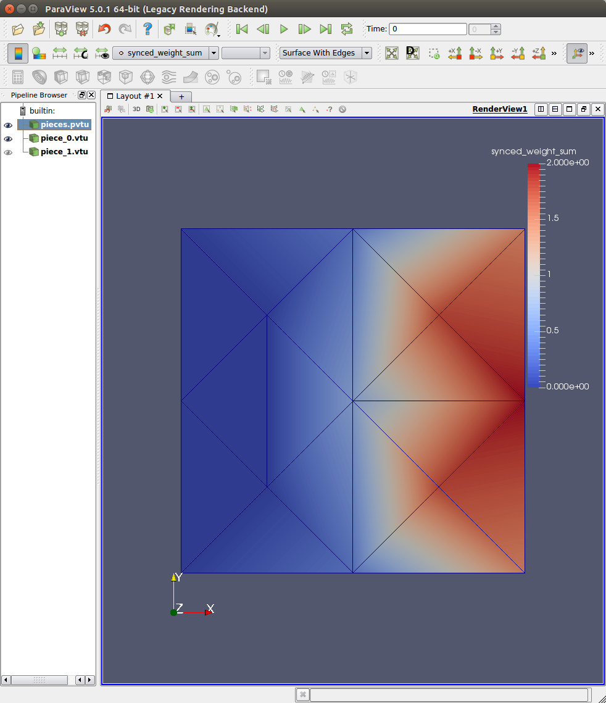  

## gradient

[`gradient`](./gradient/main.cpp) computes the gradient of the same function
as the one defined in `field_on_square`.

    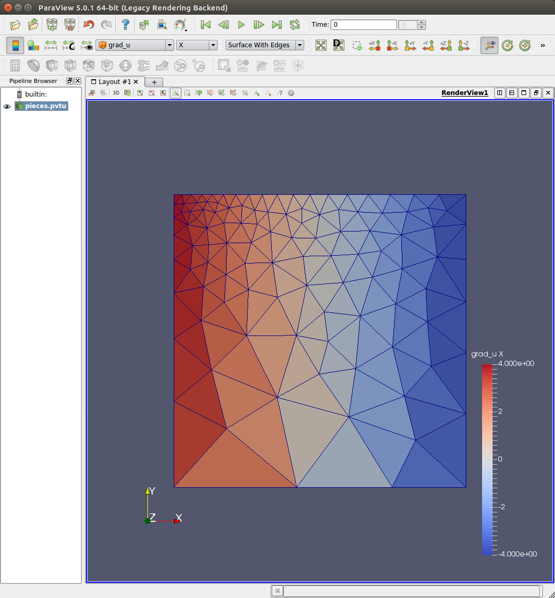 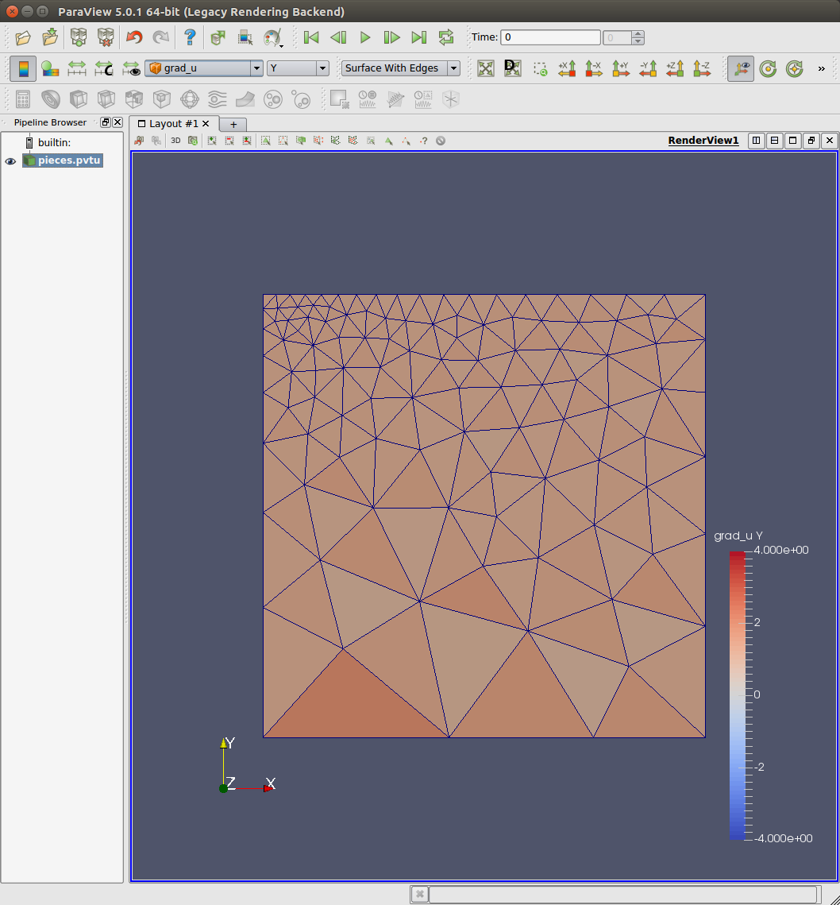  

## laplacian

[`laplacian`](./laplacian/main.cpp) computes the solution of the finite
element discretization of the 2d Poisson equation with constant
right hand side = -3 and then evaluates the local residual at each vertex
of the corresponding finite volume discretization. Note that the
iterative solution is a Richardson iteration with a *Jacobi preconditioner*.

    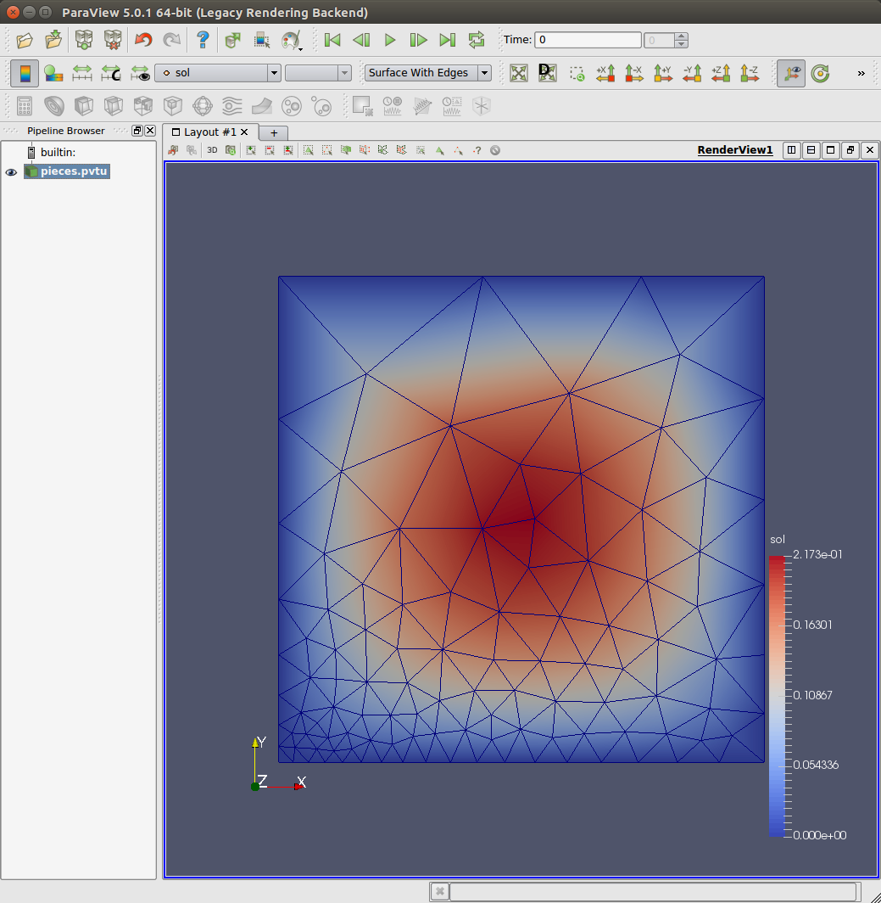

## AUTHORS

* Omar Awile <omar.awile@epfl.ch>
* Samuel Melchior <samuel.melchior@epfl.ch>
